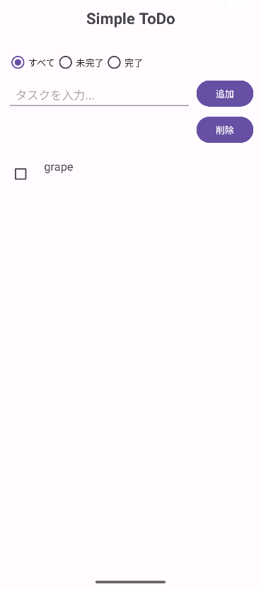

# SimpleAppNew

Android（Kotlin, Jetpack Compose）で構築したシンプルな Todo アプリです。
タスクの追加・編集・削除に加え、左スワイプ削除・右スワイプ編集に対応した直感的な UI を備えています。

# 📱 主な機能

タスクの追加

タスクの削除

スワイプ操作による編集・削除

タスク内容の保存機能（ローカル保存）

# 🛠 使用技術

Kotlin

Jetpack Compose

ChatGPT 5.1（開発支援）

# 🚀 セットアップ方法（APK インストール）

GitHub の Releases ページから最新の APK をダウンロード

Android 端末へ転送

通常の APK と同様にインストールして使用開始できます

# 📸 スクリーンショット

# 🔧 今後追加予定の機能

カスタム背景画像設定

タスクの色分けシステム

# 👥 作者・開発体制

開発者（プログラミング）：ChatGPT 5.1

マネジメント担当：あなた
